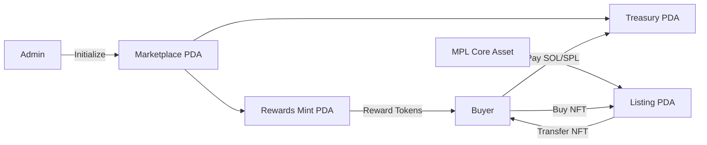

# marketplace_k
A decentralized NFT marketplace built on Solana using Anchor and MPL Core.

Marketplace K enables users to list MPL Core NFTs, purchase them using SOL or SPL tokens, delist active listings, and receive marketplace reward tokens for participating in trades.

---

## Features

* Create and configure a marketplace
* List MPL Core NFTs for sale
* Buy NFTs using SOL
* Buy NFTs using SPL tokens
* Delist NFTs and return them to the owner
* Marketplace treasury management
* Reward buyers with marketplace reward tokens
* PDA-based account architecture
* Fully on-chain marketplace logic

---

## Tech Stack

* Solana
* Anchor Framework
* MPL Core
* SPL Token Interface
* TypeScript
* LiteSVM

---

## Marketplace Architecture



---

## Program Accounts

### Marketplace PDA

Stores marketplace configuration.

Seeds:

```text
["marketplace", marketplace_name]
```

Stores:

* Marketplace name
* Marketplace authority
* Fee basis points
* Treasury information
* Reward configuration

---

### Treasury PDA

Marketplace treasury account.

Seeds:

```text
["treasury", marketplace]
```

Responsible for:

* Collecting marketplace fees
* Receiving SOL payments
* Receiving SPL token payments

---

### Rewards Mint PDA

Reward token mint used to incentivize buyers.

Seeds:

```text
["rewards", marketplace]
```

Responsibilities:

* Mint marketplace rewards
* Incentivize marketplace activity

---

### Listing PDA

Represents an NFT listing.

Seeds:

```text
["listing", asset]
```

Stores:

* Seller
* Asset
* Price
* Payment mint
* Listing status

---

## Instructions

### Initialize

Creates a new marketplace.

Responsibilities:

* Create marketplace PDA
* Create treasury PDA
* Create rewards mint PDA
* Configure marketplace fee structure

---

### List

Lists an MPL Core NFT for sale.

Responsibilities:

* Verify NFT ownership
* Create listing PDA
* Lock listing parameters

Accounts:

* Seller
* Asset
* Listing PDA
* Marketplace PDA

---

### Delist

Removes an NFT listing.

Responsibilities:

* Verify seller authority
* Close listing
* Return control to owner

---

### Buy

Purchases an NFT using SOL.

Responsibilities:

* Transfer payment
* Transfer NFT ownership
* Pay marketplace fee
* Close listing
* Mint reward tokens

Flow:

```text
Buyer
   │
   ▼
Pays SOL
   │
   ▼
Treasury receives fee
   │
   ▼
Seller receives proceeds
   │
   ▼
NFT transferred to buyer
   │
   ▼
Reward tokens minted
```

---

### Buy With Token

Purchases an NFT using an SPL token.

Responsibilities:

* Transfer SPL tokens
* Distribute marketplace fee
* Transfer NFT ownership
* Reward buyer

Flow:

```text
Buyer
   │
   ▼
Transfers SPL tokens
   │
   ▼
Treasury receives fee
   │
   ▼
Seller receives proceeds
   │
   ▼
NFT ownership transferred
   │
   ▼
Reward tokens minted
```

---

## Marketplace Fee Model

Marketplace fees are stored in basis points.

Examples:

```text
10000 = 100%
1000  = 10%
500   = 5%
100   = 1%
```

Fee calculation:

```text
marketplace_fee =
sale_price * fee_bps / 10000
```

---

## Reward System

After a successful purchase:

* Reward tokens are minted
* Tokens are sent directly to the buyer
* Rewards are distributed from the marketplace reward mint

Purpose:

* Increase marketplace engagement
* Incentivize trading activity

---

## Project Structure

```text
programs/
└── marketplace_k/
    └── src/
        ├── instructions/
        │   ├── initialize.rs
        │   ├── list.rs
        │   ├── delist.rs
        │   ├── buy.rs
        │   └── buy_with_token.rs
        │
        ├── state.rs
        ├── constants.rs
        ├── error.rs
        └── lib.rs

tests/
└── marketplace_k.ts
```

---

## Build

```bash
anchor build
```

---

## Test

```bash
anchor test
```

---

## Future Improvements

* Offer system
* Auction support
* Royalty distribution
* Collection verification
* Multi-payment token support
* Escrow vault optimization
* Compressed NFT support

---

## Security Considerations

* PDA-based authority model
* Explicit ownership validation
* Marketplace fee enforcement
* Controlled reward minting
* Seller authorization checks
* Secure NFT transfer flow

---

## License

MIT

```
```
